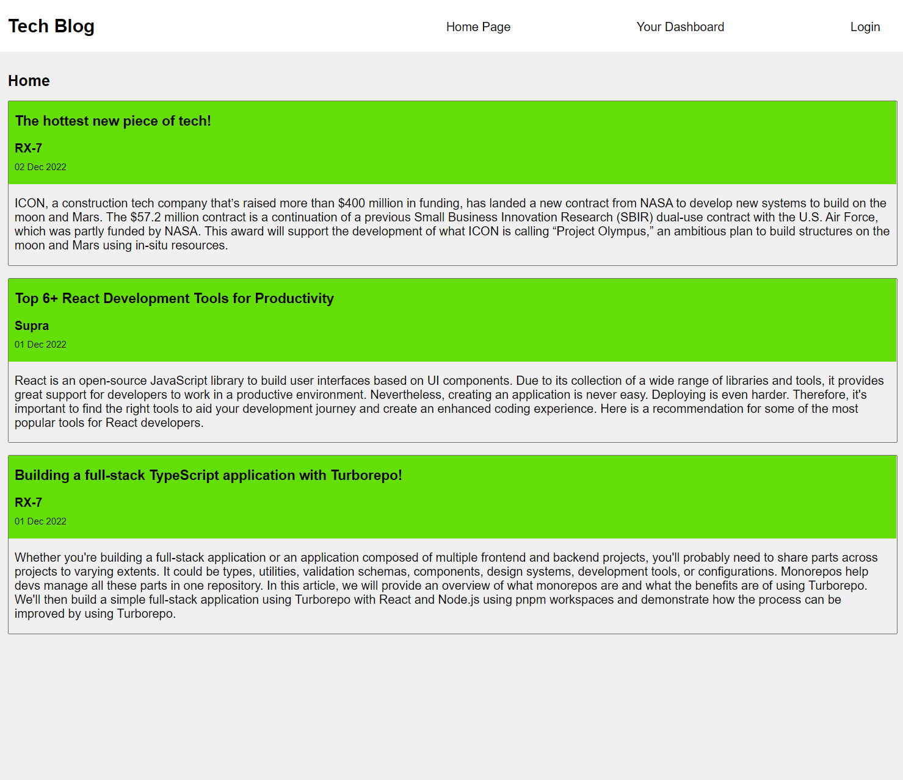
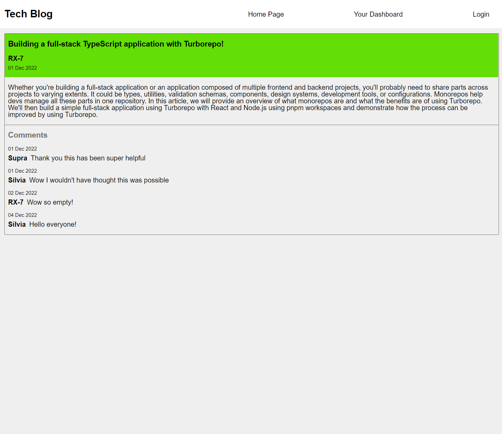
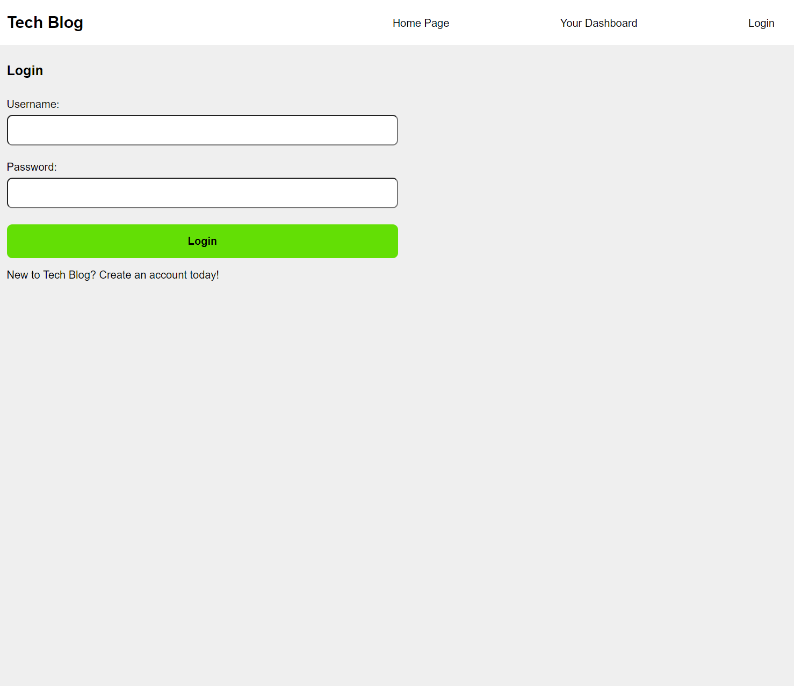
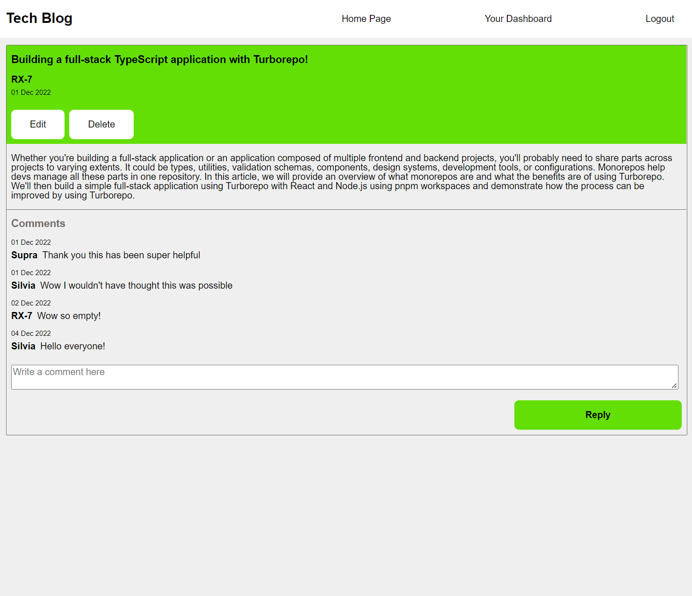
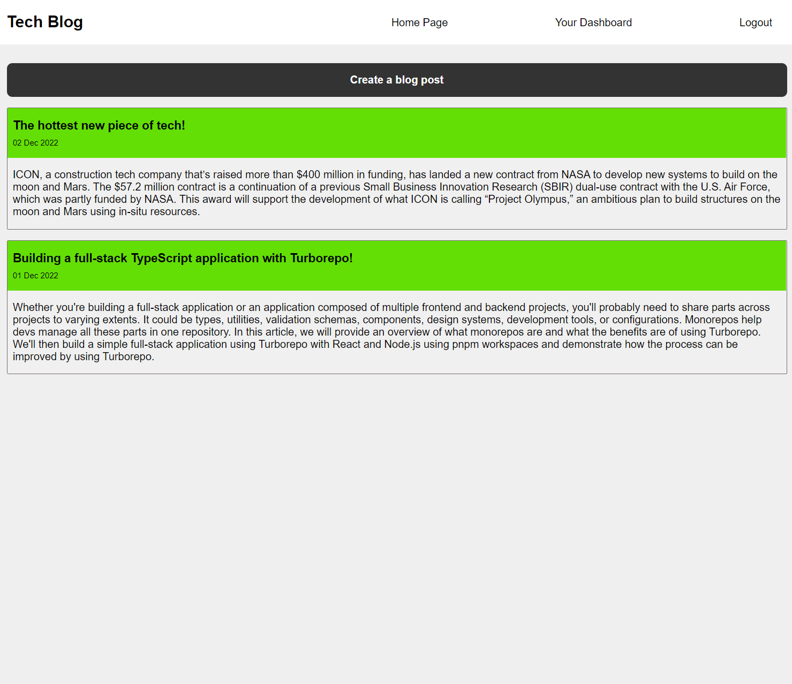
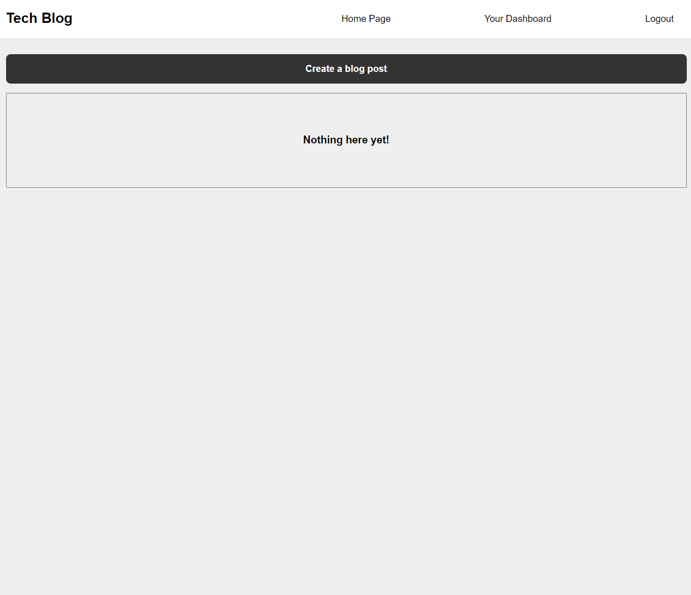
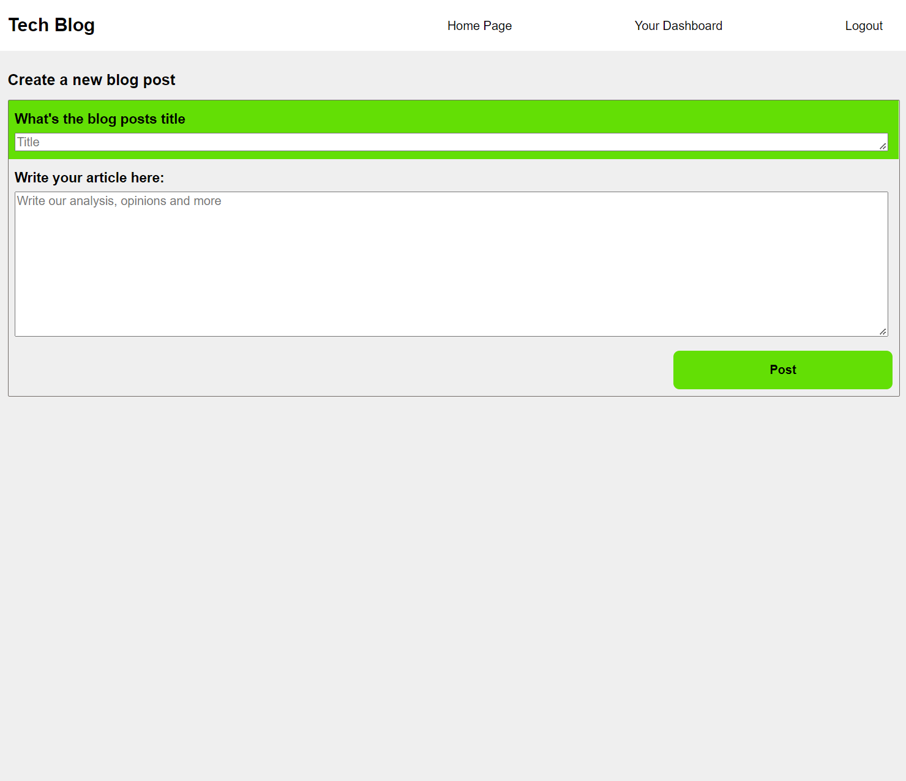

# Tech Blog

## Description
This application is a CMS style blog site where people can view blog posts on the latest in the tech world. People can create an account and post their own blogs. Posts are uploaded to the homepage in descending order. When signed in there is an option to leave a comment, which will be displayed with the users username and date they posted their comment. 

## Table of Contents
  - [Description](#description)
  - [Table of Contents](#table-of-contents)
  - [Installation](#installation)
  - [Usage](#usage)
  - [Technology](#technology)
  - [License](#license)
  - [Questions](#questions)

## Installation 
Before attempting to use this application, you must have the follow programs installed to your computer: 

  - VS Code
  - Node.js
  
  In the terminal of VS Code please install enter the following to install all dependencies: 
  ```bash
  npm install
  ```
[Express.js](https://expressjs.com/en/starter/installing.html)

## Usage

You can visit the live site here [Launch Tech Blog](https://polar-reaches-81456.herokuapp.com/)

Or 

 To use the application locally please clone the repo to your local environment.

 The application will be invoked by using the following command:

  ```bash
  node server.js
  ```
  Then in your preferred browser open http://localhost:3001

When you enter the site you will be presented with the homepage. Here blog posts will show up regardless if you are signed in.



If you click a blog post you will directed to view that post in full detail with all the comments loaded below. However to comment you need to be signed in.



When trying to view the dashboard you will be prompted to sign in or create an account. After signing in the login button will switch to logout!



When redirecting to a blog that you have posted you will see the options "edit" and "delete" show up under the creation date. Also note here you can see the comment form unlocked due to the user being signed in. 



Now that the user is signed in their dashboard will display a list of posts they have uploaded. Otherwise it will display a message "Nothing here yet"




Lastly clicking the "Create a blog post" the user is directed to the create endpoint with a title and article input area. 



## Technology
Technologies used in this project are:
* Visual Studio Code
* HTML
* CSS
* Javascript
* Express
* MySQL
* Sequelize
* Express-Handlebars
* Express-Sessions
* Handlebars-helpers
* BCrypt
* Dotenv
* Date-fns

## License 


# Questions

## Feel free to reach out if you have any enquiries

Andrew Beissmann:
* Email: andrew60199@gmail.com
* GitHub: [@andrew60199](https://github.com/andrew60199)


